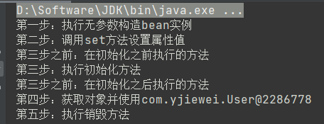

## 如何创建一个spring项目？
1. 新建一个空maven工程
2. 引入依赖
3. 创建配置文件 src/application.xml
4. 在配置文件中引入标签beans
   - 在src目录下新建xml configuration file -> spring config会自动生成
   
5. 配置文件需要放在resources目录下，可能是因为我这是maven工程的原因


## IOC
- 反转控制，把对象的创建和对象之间的调用过程交给spring管理
- 降低耦合
- 原理：xml解析、工厂模式、反射

---
IOC过程
```java
// 1.工厂模式
class UserFactory{
    public static UserDao getDao(){
        return new UserDao();
    }
}
```
```xml
<!-- 2.xml配置文件，配置创建的对象 -->
<!--注入到容器中，并设置示例对象值-->
<bean id="person" class="com.yjiewei.Person">
   <constructor-arg index="0" value="杨杰炜"/>
   <constructor-arg index="1" value="23"/>
</bean>
```
```java
class UserFactory{
   public static UserDao getDao(){
      String classValue = "class属性值"; // 通过xml解析
      Class clazz = Class.forName(classValue); // 通过反射创建对象
      return (UserDao)clazz.newInstance();
   }
}
```
spring 提供IOC容器实现的两种方式（两个接口）
- BeanFactory (spring内部使用，不推荐开发使用)
  - 在使用时才会去创建对象，加载配置文件时不会去创建对象
- ApplicationContext
  - 加载配置文件的时候就会把在配置文件对象进行创建
   

ApplicationContext实现类
- ClassPathXmlApplicationContext
- FileSystemXmlApplicationContext

1. 注入属性值的三种方式
```xml
    <!--注入到容器中，并设置示例对象值-->
    <bean id="person" class="com.yjiewei.Person">
        <!-- 1.这里如果没有空参构造器就会让你设置值；所以这里相当于通过xml构造器的方式设置属性-->
        <!--  <constructor-arg index="0" value="杨杰炜"/>-->
        <!--  <constructor-arg index="1" value="23"/>-->

        <!-- 2.通过property完成属性注入-->
        <property name="name" value="yjiewei"/>
        <property name="age" value="23"/>

        <!-- 3.p名称空间注入 其实就是简化property，引入名称空间，使用p标签-->
    </bean>
```

2. xml注入其他数据类型（比如null，特殊字符）
```xml
    <bean id="person" class="com.yjiewei.Person">
        <!--属性中设置null值-->
        <property name="name">
            <null/>
        </property>
        <!--属性中包含特殊字符 1.把<>进行转义 &lt; &gt; 2.把带特殊符号内容写到CDATA-->
        <property name="name">
            <value><![CDATA[<<杨杰炜>>]]></value>
        </property>
        <property name="age" value="23"/>
    </bean>
```
3. xml注入外部bean
```java
public class UserService {
    // 1.创建UserDao类型属性，生成set方法
    // 2.再通过application.xml去注册bean对象，再userService bean中注入userDao
    private UserDao userDao;

    public void setUserDao(UserDao userDao) {
        this.userDao = userDao;
    }

    public void add() {
        System.out.println("test service set dao");
        userDao.update();
    }
}
```
```xml
    <bean id="userService" class="com.yjiewei.service.UserService">
        <!--这里注入外部bean对象-->
        <property name="userDao" ref="userDao"/>
    </bean>
    <bean id="userDao" class="com.yjiewei.dao.impl.UserDaoImpl"/>
```
4. 注入属性-内部bean和级联赋值
    1. 一对多的关系（部门与员工） 
    ```XML
   <!--这里是一个bean的属性，属性中指定bean，就变成在内部的方式，其实都一样-->
    <property name="userDao">
        <bean id="person" class="com.yjiewei.Person">
            <property name="name" value="yjiewei"/>
            <property name="age" value="23"/>
        </bean>
    </property>
    ```
   2. 级联赋值（其实就是在注入外部bean时对外部bean属性进行赋值）（或者是直接对外部bean的属性值直接赋值 eg person.age ）
    
5. 注入集合类型属性（数组, list, map, set）
```xml
    <!--数组属性值注入-->
    <property name="courses">
        <array>
            <value>java</value>
            <value>mysql</value>
            <value>python</value>
        </array>
    </property>

    <!--list属性值注入-->
    <property name="courses">
        <list>
            <value>java</value>
            <value>mysql</value>
            <value>python</value>
        </list>
    </property>
    
    <!--map属性值注入-->
    <property name="courses">
        <map>
            <entry key="java" value="java"/>
            <entry key="java" value="java"/>
        </map>
    </property>
        
    <!--set属性值注入-->
    <property name="courses">
        <set>
            <value>java</value>
            <value>mysql</value>
            <value>python</value>
        </set>
    </property>

    <!--其他方式注入集合-->
    <!--提取list集合类型属性注入使用，记得引入标签-->
    <util:list id="bookList">
        <value>杨杰炜</value>
        <value>杨杰炜</value>
        <value>杨杰炜</value>
    </util:list>
```

6. bean管理（工厂bean） com.yjiewei.factoryBean.MyBean
    1. spring中有两种类型的bean（普通bean，工厂bean）
    2. 工厂bean在配置文件定义bean类型可以和返回类型不一样
    
7. bean的作用域
    1. 设置bean实例是单实例还是多实例
    2. 默认是单实例
    3. scope
    ```xml
        <bean id="myBean" class="com.yjiewei.factoryBean.MyBean" scope="singleton"/>
        <bean id="myBean" class="com.yjiewei.factoryBean.MyBean" scope="prototype"/>
    ```

8. bean的生命周期(创建到销毁) com.yjiewei.User
   > 在第三步的时候可以用bean的后置处理器（实现接口BeanPostProcessor）
    1. 通过构造器创建bean实例（无参数构造）
    2. 为bean属性设置值和对其他bean引用（调用set方法）
       
       [3] bean实例传递给后置处理器方法 com.yjiewei.UserPost
    3. 调用bean的初始化方法（配置初始化方法）
       
       [3] bean实例传递给后置处理器方法
    4. bean可以使用了（获取到对象）
    5. 容器关闭时，调用bean的销毁方法（需要配置销毁方法）
    
    
   
9. xml自动装配
    ```xml
    <bean id="userService" class="com.yjiewei.service.UserService" autowrie="byName">
        <!--这里注入外部bean对象-->
        <!--不用这种方式去装配，直接用autowire="byName" 只要名字对应上了就可以了-->
        <!--还有byType不过不能出现多个同类型的bean-->
        <!--<property name="userDao" ref="userDao"/>-->
    </bean> 
    ```

10. 外部属性文件
    1. 直接配置数据库信息
    2. 引入外部属性文件配置数据库连接池
    
11. 基于注解的方式管理bean(对象创建、属性注入)
    1. 创建对象
        - @Component
        - @Service
        - @Controller
        - @Repository
    2. 使用配置类的方式注入bean
    ```java
        @Configuration
        @ComponentScan(basePackages = {"com.yjiewei.service"}) // 这里我用com.yjiewei的时候出错了，不知道什么原因导致
        public class SpringConfig {
            @Bean
            public User user(){
                return new User();
            }
        }
    ```
---
## AOP
1. 概念
    - 百度啥都有
    - 解耦解耦，全都是为了解耦
    - 将日志记录、事务、异常、安全控制等从业务逻辑中抽离出来
    - 这就是面向切面编程（可以不通过修改逻辑代码实现新的功能）

2. AOP底层使用原理
    1. 有两种情况动态代理(代理就是为了增强类的方法)
        - 有接口的情况，使用JDK动态代理
          ```java
            // 创建该接口实现类代理对象
            interface UserDao {
                public void login();
            }
            class UserDaoImpl implements UserDao {
                public void login(){
                    // 实现登录过程
                }
            }
          ```
        - 没有接口的情况，使用CGLIB动态代理
          
          `创建当前类子类的代理对象`
    
    2. java.lang.reflect.Proxy
       
        `static Object newProxyInstance(ClassLoader loader, 类<?>[] interfaces, InvocationHandler h)返回指定的接口，将方法调用指定的调用处理程序的代理类的一个实例。`  
       InvocationHandler是创建代理对象，写增强的部分

    3. 术语
       - 连接点：类里面哪些方法可以被增强，这些方法称为连接点
       - 切入点：实际被真正增强的方法，称为切入点
       - 通知（增强）：实际增强的逻辑部分称为通知（增强）；通知有多种类型（前置后置环绕异常最终）
       - 切面：是动作，把通知应用到切入点过程
    
    4. AOP操作（基于AspectJ）
       - 基于AspectJ实现AOP操作
            - xml
            - 注解
       - 引入依赖
       - 切入点表达式
            - 知道对哪个类方法进行增强
            - execution([权限修饰符][返回类型][类全路径][方法名称]([参数列表]))
            


